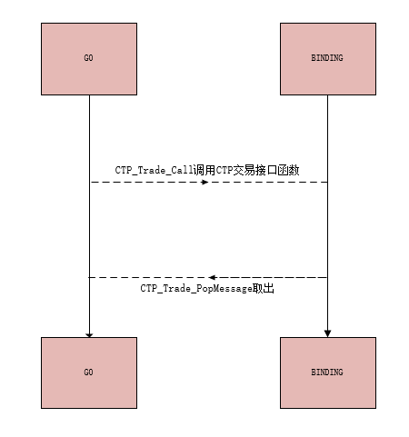

# CTP-BINDING

- 用于go调用ctp接口
- 采用的是syscall方式,仅限windows平台
- ftdc直连协议在测试中,可跨平台
- 与 [goshare](https://github.com/mineralres/goshare) 配合使用
- binding维护了一个消息队列用于ctp回调的传递到go中

# 示意图

* 交易接口调用示意图

* 行情接口与交易接口原理一样

# 交流

* QQ群 1018983692 
